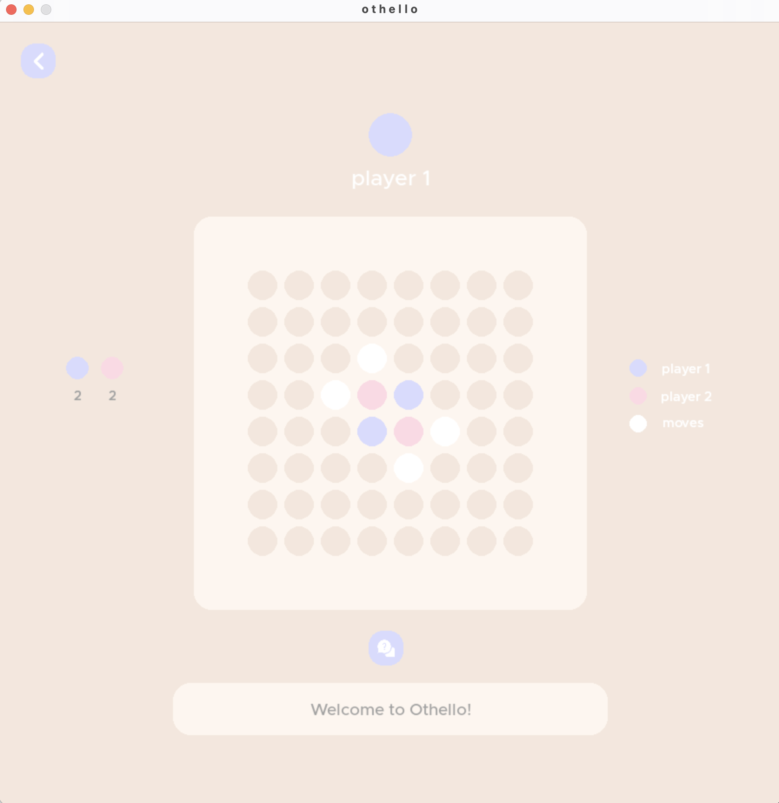
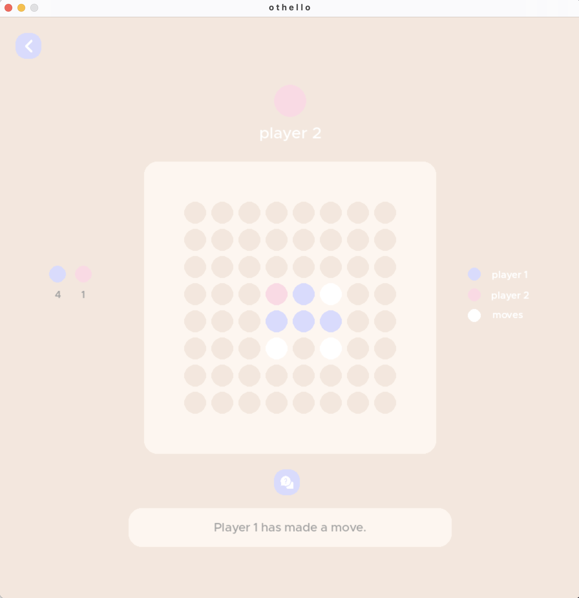
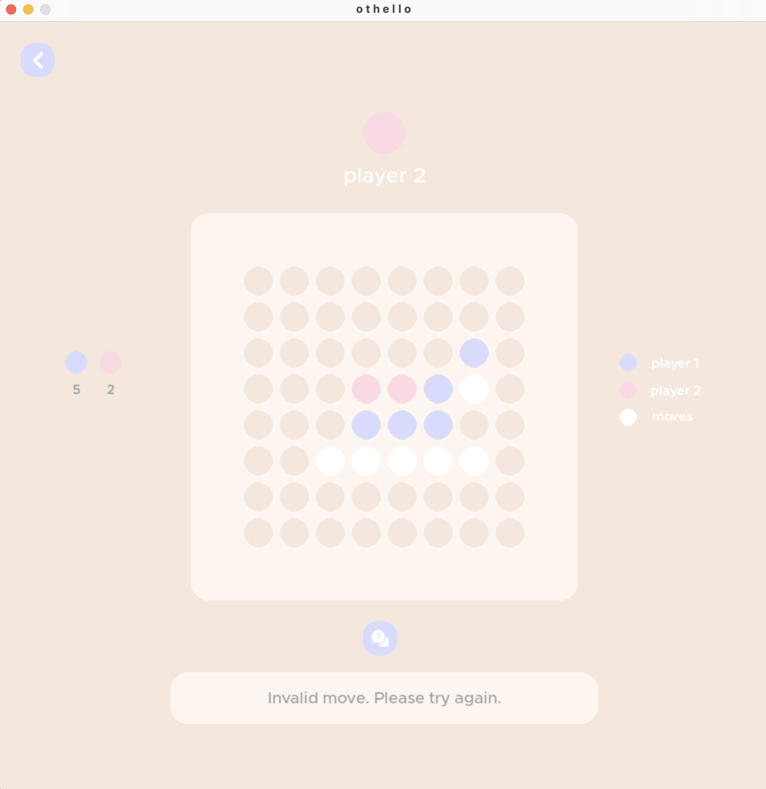
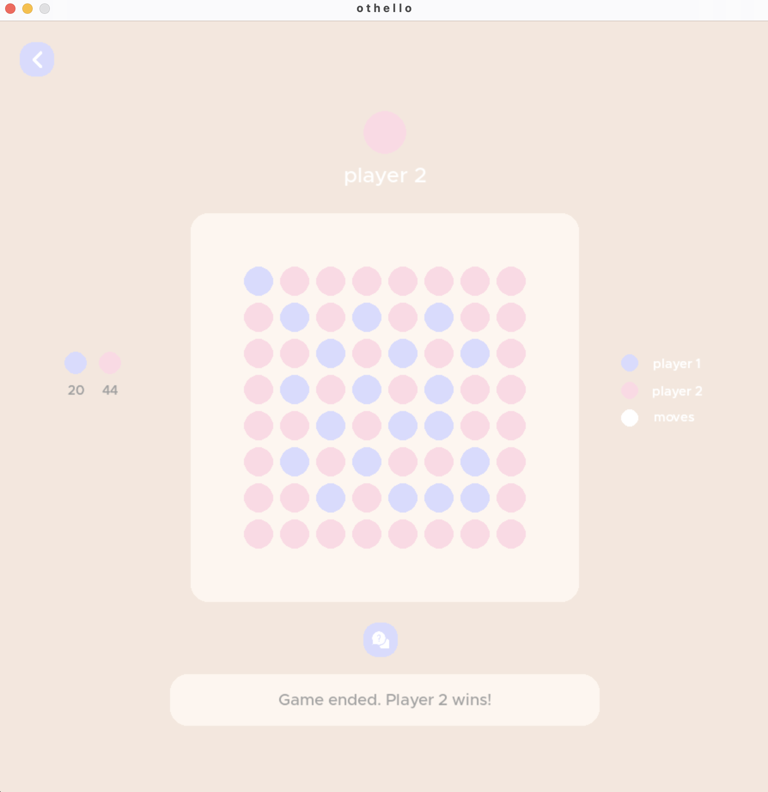

# Othello

The program is a final project from coursework CS 162 - Intro to CS II at Oregon State University. I successfully developed and implemented Othello through this final project, showcasing my proficiency in computer science concepts. Utilizing Object-Oriented Programming (OOP) principles and data structures, I organized the game components to ensure efficient data management and scalability, resulting in enhanced dynamic gameplay mechanics. To further elevate the project, I transformed it into a visual application using PyCharm. By incorporating code modifications, I successfully implemented a player-based turn system, significantly improving the project's functionality and providing an elevated user experience.

Project Overview
```
This program is designed to mimic the classic Reversi game in a visual format, utilizing multiple classes and methods to recreate the gameplay between two players. The implementation involves structuring the game logic and mechanics using object-oriented programming principles, with each player taking turns to strategically place their pieces on the game board. The program utilizes various methods within the classes to handle moves, validate input, check for valid moves, update the board, and determine the winner. 
```

## Getting Started

Simply retrieve a copy of the repository using HTTPS, SSH, or GitHUB CLI methods and add them to your IDE. 

### Prerequisites

These items must be installed in order for the program to work:
```
1. Python (make sure that the current version is installed)
2. PIP -- used to install python packages
3. Pygame
```

### Gameplay

Screenshots of several player based turns and game state:
```


```

## Built With

* [Python](http://www.dropwizard.io/1.0.2/docs/) - The web framework used
* [PyCharm](https://maven.apache.org/) - Dependency Management
* [GitHub](https://maven.apache.org/) - Version Control Management


## Contributing

Designed and programmed by Dianna

## Authors

* **Designed and programmed by Dianna** - *All works* - [GitHub](https://github.com/dianna-SE)

## License

Please provide credits wherever due if you intend to use my work for parts of your own work!